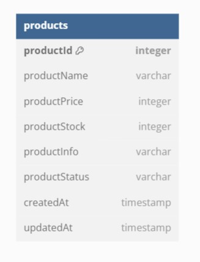

# 주제: adidas
## 1. 전체 요구 사항 분석
* 회원 가입
* 회원 가입 예외 처리
* 휴대 전화 인증
* 로그인
* 아이디 찾기
* 비밀번호 찾기
* 전체 상품 조회
* 상품 등록
* 상품 수정
* 상품 재고 변경
* 상품 상태 변경
* 상품 페이징 처리
* 전체 주문 목록 조회
* 전체 주문 목록 상세 조회
* 배송 상태 변경
* 주문 목록 페이징 처리
* 사용자 정보 수정
* 주소지 추가
* 주소지 삭제
* 주소지 조회
* 카테고리로 나누어 상품 조회
* 한 페이지에 10개씩 나누어 조회
* 장바구니 구매
* 상품 정보에서 바로 구매
* 구매 목록 보기

## 2. 도메인 분리
* 회원 서비스
* 장바구니 서비스
* 상품 서비스
* 주문 서비스

## 3. 도메인 상세
### a. REST API
|Name|Method|API Path|
|---|---|---|
|전체 상품 조회|GET|/api/products|
|상품 등록|POST|/api/products|
|상품 수정|PUT|/api/products/{id}|
|상품 재고 변경(수정)|PUT|/api/products/stocks/{id}|
|상품 상태 변경(수정)|PUT|/api/products/status/{id}|
|카테고리별 상품 조회|GET|/api/products/categories/{id}|

### b. DB 설계

### c. 클래스 다이어그램
